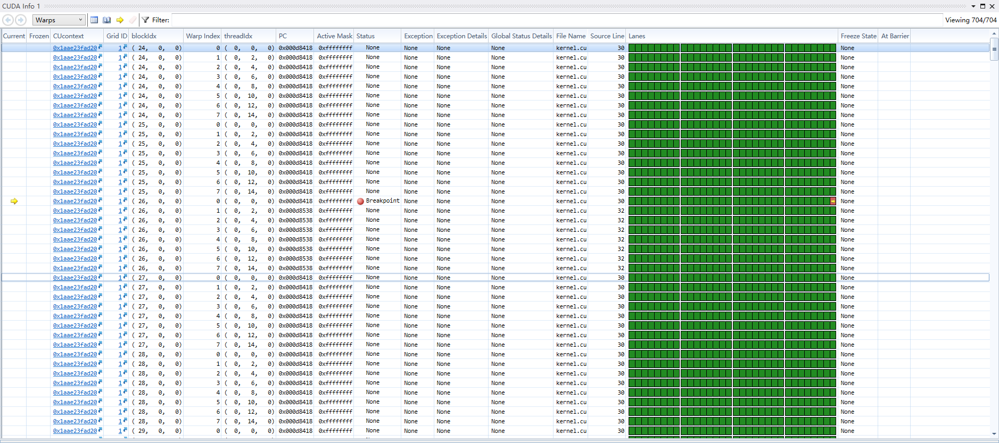
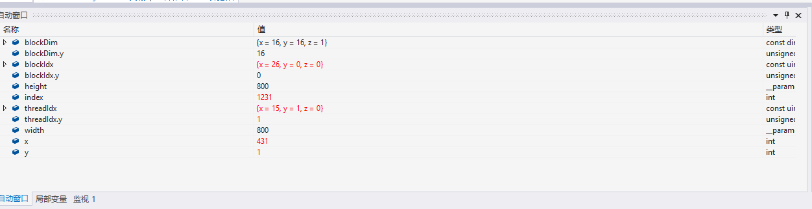

Project 0 CUDA Getting Started
====================

**University of Pennsylvania, CIS 565: GPU Programming and Architecture, Project 0**

* Jizhou Yan	
* Tested on: Windows 10, i7-4789K @ 4.00GHz 32GB, GTX 1080Ti(Personal Laptop)

### Screenshots 

* Application window screenshot for **Part 4: Modify**

* Timeline screenshot for **Part 5: Analyze**

* Debugging screenshot for **Part 6: Nsight Debugging**

